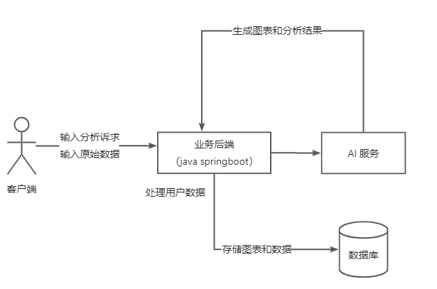
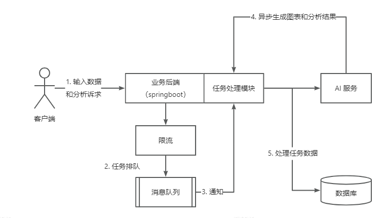
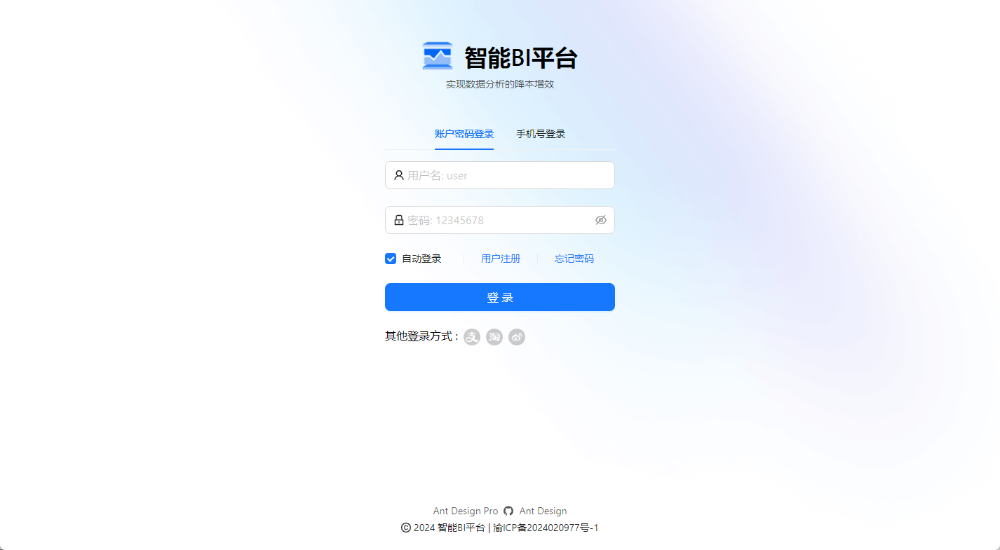
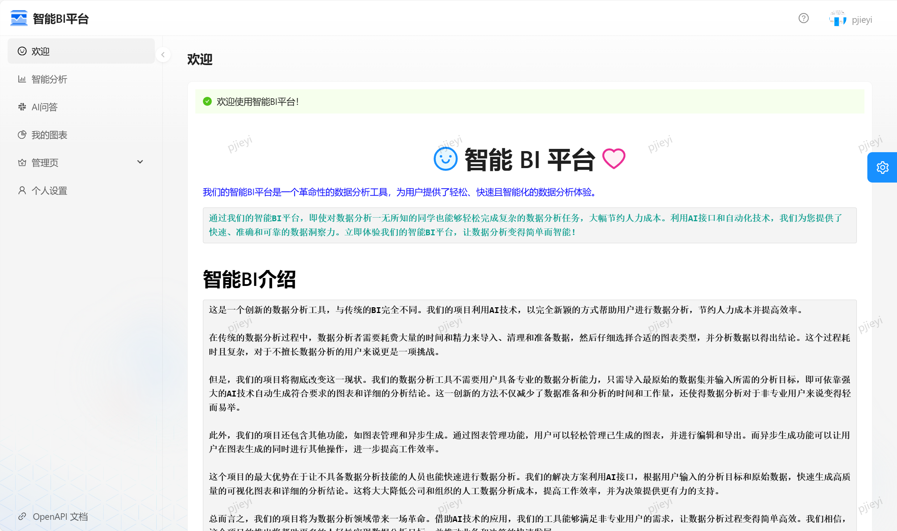
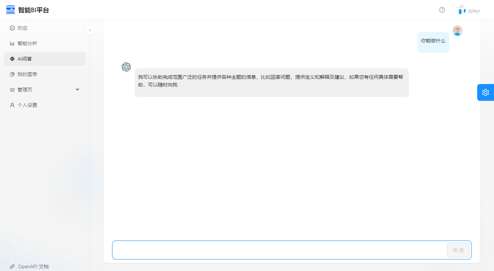
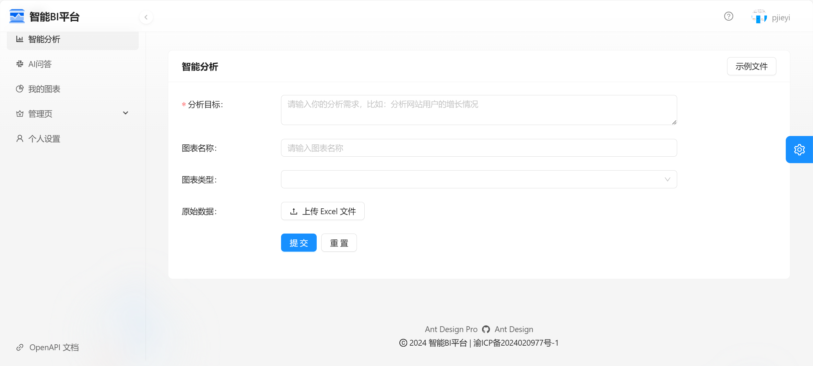
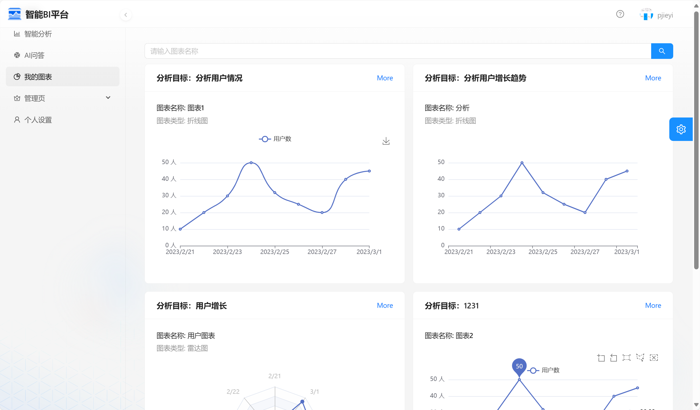
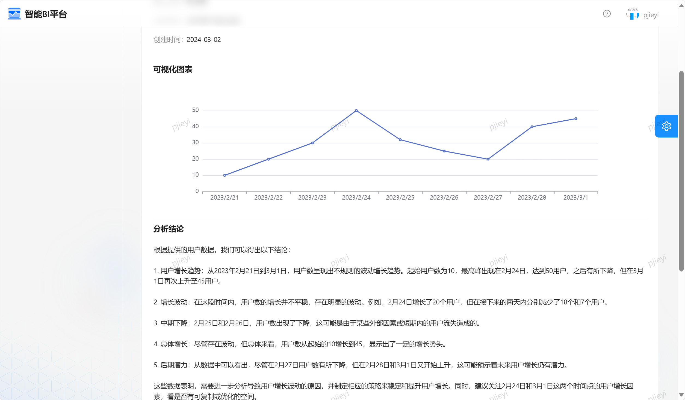
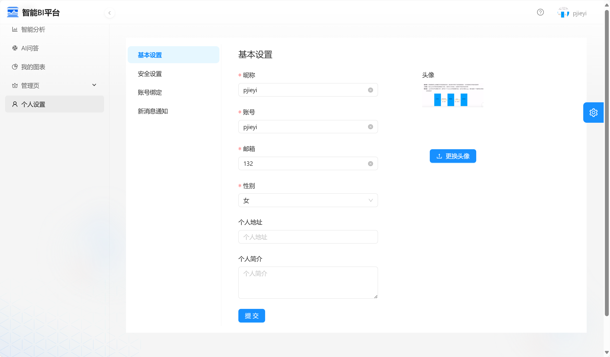
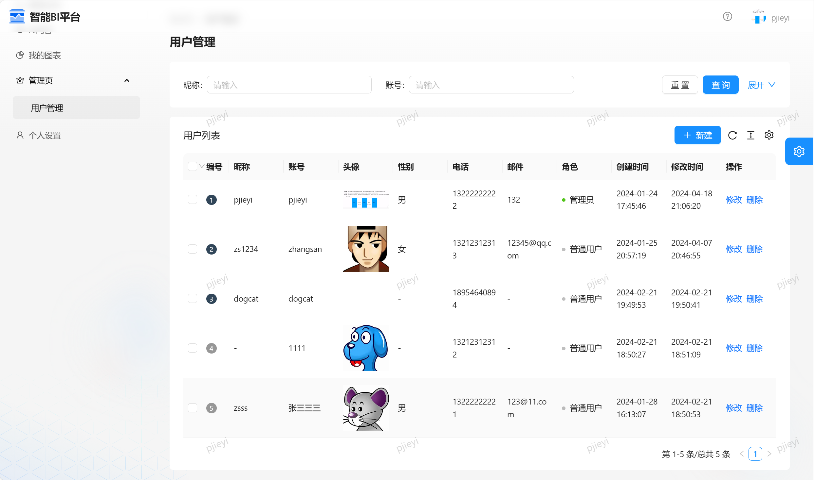

# 智能 BI 平台

## 项目介绍

项目地址:  http://originai.icu/

区别于传统的 BI，用户（数据分析者）只需要导入最最最原始的数据集，输入想要进行分析的目标（比如帮我分析一下网站的增长趋势），就能利用 AI 自动生成一个符合要求的图表以及结论。

## 项目背景

1. 基于AI快速发展的时代，AI + 程序员 = 无限可能。
2. 传统数据分析流程繁琐：传统的数据分析过程需要经历繁琐的数据处理和可视化操作，耗时且复杂。
3. 技术要求高：传统数据分析需要数据分析者具备一定的技术和专业知识，限制了非专业人士的参与。
4. 人工成本高：传统数据分析需要大量的人力投入，成本昂贵。
5. AI自动生成图表和分析结论：该项目利用AI技术，只需导入原始数据和输入分析目标，即可自动生成符合要求的图表和分析结论。、
6. 提高效率降低成本：通过项目的应用，能够大幅降低人工数据分析成本，提高数据分析的效率和准确性。

## 需求分析

1. 智能分析：用户输入目标和原始数据（图表类型），可以自动生成图表和分析结论
2. 图表管理
3. 图表生成的异步化（消息队列）
4. 对接 AI 能力

## 架构图

基础流程：

优化流程（异步化）：

## 技术栈

### 前端

- React 18
- Umi 4 前端框架
- Ant Design Pro 5.x 脚手架
- Ant Design 组件库
- OpenAPI 代码生成：自动生成后端调用代码
- EChart 图表生成
- umi openapi 代码生成（自动生成后端调用代码）

### 后端

- Spring Boot 2.7.2
- Spring MVC
- MyBatis + MyBatis Plus 数据访问（开启分页）
- Spring Boot 调试工具和项目处理器
- Spring AOP 切面编程：鉴权、记录日志
- Spring 事务注解
- Redis：Redisson限流控制
- MyBatis-Plus 数据库访问结构
- IDEA插件 MyBatisX ： 根据数据库表自动生成
- RabbitMQ：消息队列
- 百度api：ai分析接口
- JDK 线程池及异步化
- Swagger + Knife4j 项目文档
- Guava retrying 任务重试机制

### 数据存储

- MySQL 数据库
- Redis 内存数据库

### 工具类

- Easy Excel 表格处理
- Hutool 工具库
- Apache Commons Lang3 工具类
- Lombok 注解

## 项目截图

